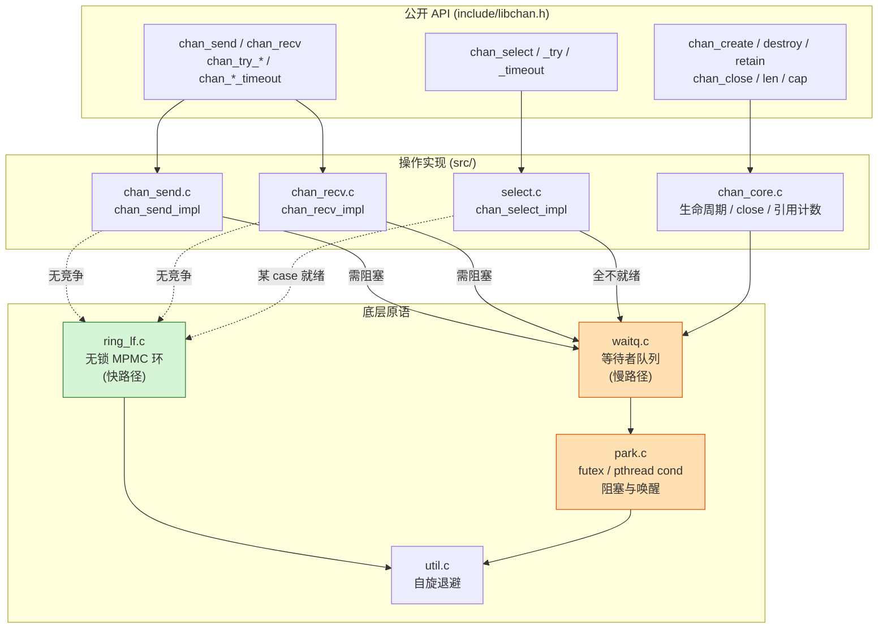
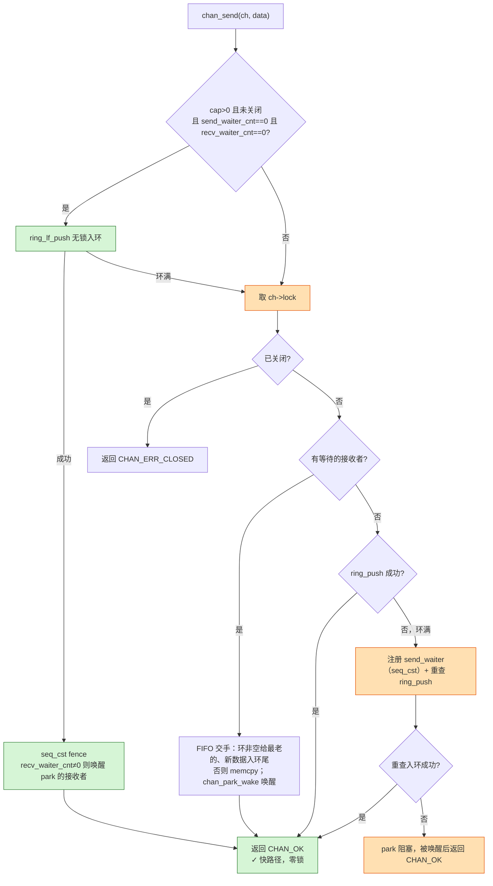
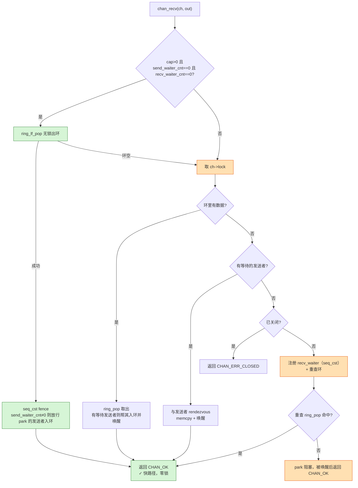
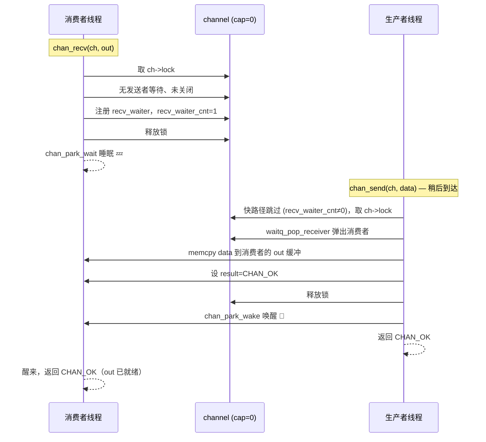

# libchan 架构与工作原理

本文用四张图描述 libchan 的工作原理：**分层组件**、**send 快慢路径**、**recv 快慢路径**、
**无缓冲 rendezvous 时序**。图均为 Mermaid，可在 GitHub 及多数 Markdown 查看器直接渲染。

---

## 1. 分层组件图

libchan 把"无竞争时零锁、需要阻塞时才取锁 park"作为核心策略，分三层：
公开 API → 操作实现（每个 op 先试无锁快路径，失败回退加锁慢路径）→ 底层原语。

> 绿色 = 无锁快路径，橙色 = 加锁慢路径。每个通道含一个无锁环（缓冲）、
> 两个等待队列（send/recv）、两个原子 waiter 计数，外加一把保护慢路径的 mutex。

---

## 2. send 快慢路径流程图

核心机制：当**两个 waiter 计数都为 0**（无人阻塞）时，直接对无锁环做 `ring_lf_push`，
完全绕过 mutex；否则取锁走慢路径，必要时注册等待者并 park。注意快路径推送成功后会用
一道 `seq_cst` fence 重查 `recv_waiter_cnt`，把数据交给在竞态窗口里刚 park 的接收者，
避免丢唤醒。下图忠于 `chan_send_impl`（`src/chan_send.c`）。

---

## 3. recv 快慢路径流程图

对称地，无竞争时直接 `ring_lf_pop` 出环；否则取锁，依次尝试"取环中数据"、"与等待发送者
rendezvous"，都不行则注册等待者 park。同样地，快路径弹出后用 `seq_cst` fence 重查
`send_waiter_cnt`，把刚腾出的空位让给 park 的发送者；注册后也会再查一次环才真正 park。
下图忠于 `chan_recv_impl`（`src/chan_recv.c`）。

> **为什么用 waiter 计数当门槛**：只要有线程睡在 send/recv 队列里，所有线程就一律走
> 加锁慢路径，保证"接收者帮发送者入环"等操作不会和并发的无锁 push 竞争。无竞争时
> 计数全 0，快路径生效，这是 SPSC/MPMC 高吞吐的来源。
>
> **避免丢唤醒**：无锁快路径与"注册等待者"之间存在竞态窗口——快路径可能在接收者检查
> 完环、但其计数尚未对发送者可见时推入数据，导致接收者抱着环里的数据永久 park。两侧各用
> 一道 `seq_cst` fence 构成 StoreLoad（Dekker）屏障：要么等待者注册后重查时看到数据，
> 要么快路径重查时看到计数并唤醒它，二者不会同时错过。

---

## 4. 无缓冲 rendezvous 时序图

`cap==0` 的通道没有缓冲，发送与接收必须**同步握手**：先到者注册等待者并 park 睡眠，
后到者直接把数据交给它并 `chan_park_wake` 唤醒。下图是"接收者先到、发送者后到"的情形。

> 对称地，若发送者先到，则它注册 send_waiter 并 park，由后到的接收者完成 memcpy 与唤醒。
> 唤醒底层是 Linux futex（`park.c`，无 futex 的平台回退到 pthread cond）。
> 这条 park/wake 往返（~1–2 µs 内核延迟）正是无缓冲场景吞吐的主导成本。

---

## 延伸阅读

- 并发设计与内存序细节：[`design.md`](design.md)
- 无锁环协议（reserve→write→commit）：源码 [`src/ring_lf.h`](../src/ring_lf.h) 顶部注释
- 跨语言性能对比：[`comparison.md`](comparison.md)
- API 参考：[`api_reference.md`](api_reference.md)
