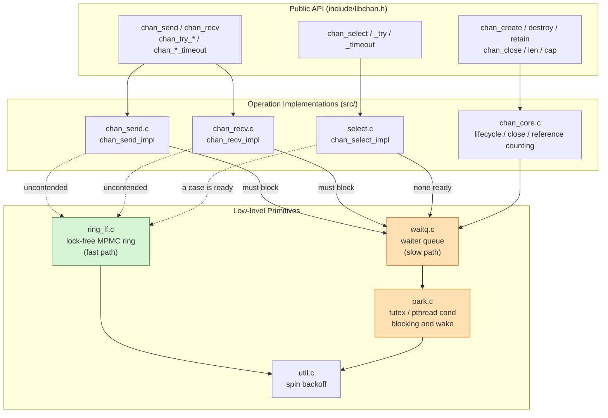
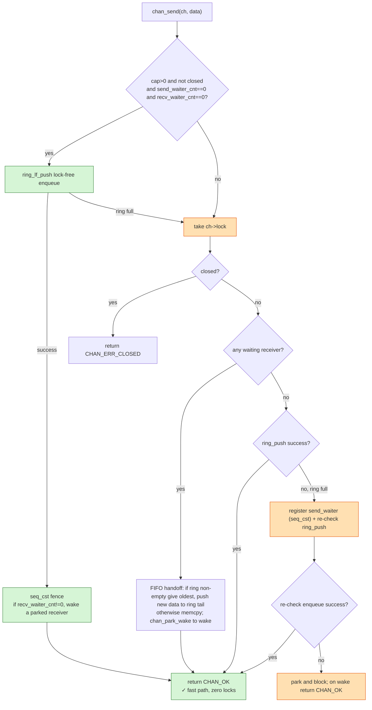
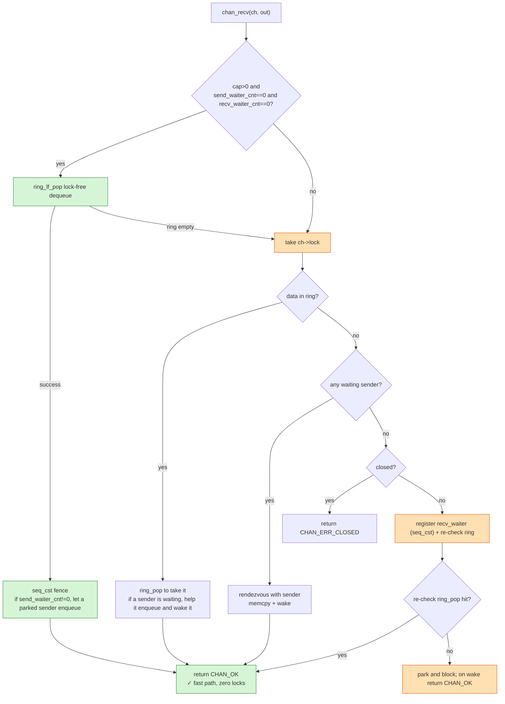
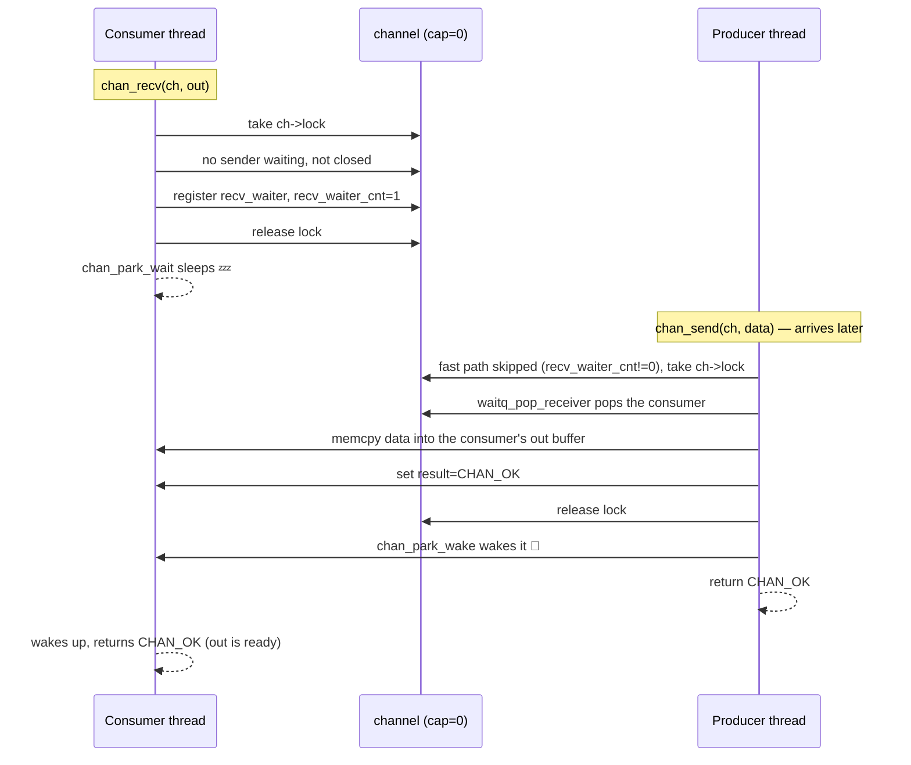

# libchan Architecture and Internals

This document explains how libchan works through four diagrams: **layered components**, **send fast/slow path**, **recv fast/slow path**, and the **unbuffered rendezvous sequence**. All diagrams are Mermaid and render directly on GitHub and in most Markdown viewers.

---

## 1. Layered Component Diagram

libchan adopts "zero locks when uncontended, take the lock and park only when blocking is required" as its core strategy, organized into three layers:
public API -> operation implementations (each op first tries the lock-free fast path, then falls back to the locked slow path on failure) -> low-level primitives.

> Green = lock-free fast path, orange = locked slow path. Each channel holds one lock-free ring (the buffer),
> two wait queues (send/recv), two atomic waiter counts, plus one mutex protecting the slow path.

---

## 2. Send Fast/Slow Path Flowchart

Core mechanism: when **both waiter counts are 0** (nobody is blocked), `ring_lf_push` is performed directly on the lock-free ring,
bypassing the mutex entirely; otherwise the lock is taken and the slow path runs, registering a waiter and parking if necessary. Note that after a successful fast-path push, a
`seq_cst` fence re-checks `recv_waiter_cnt` to hand the data to a receiver that just parked in the race window,
avoiding a lost wakeup. The diagram below faithfully follows `chan_send_impl` (`src/chan_send.c`).

---

## 3. Recv Fast/Slow Path Flowchart

Symmetrically, when uncontended `ring_lf_pop` dequeues directly from the ring; otherwise the lock is taken, and it tries in order to "take data from the ring", "rendezvous with a waiting sender",
and if neither works, registers a waiter and parks. Likewise, after a fast-path pop a `seq_cst` fence re-checks
`send_waiter_cnt` to give the just-freed slot to a parked sender; after registering it also re-checks the ring once before actually parking.
The diagram below faithfully follows `chan_recv_impl` (`src/chan_recv.c`).

> **Why use waiter counts as the gate**: as long as a thread is sleeping in the send/recv queue, every thread takes the
> locked slow path, ensuring that operations like "receiver helps a sender enqueue" never race with a concurrent lock-free push. When uncontended the
> counts are all 0, the fast path takes effect, and this is the source of high SPSC/MPMC throughput.
>
> **Avoiding lost wakeups**: a race window exists between the lock-free fast path and "registering a waiter" -- the fast path may push data after a receiver has
> finished checking the ring but before its count is visible to the sender, leaving the receiver parked forever while data sits in the ring. Each side uses
> a `seq_cst` fence to form a StoreLoad (Dekker) barrier: either the waiter sees the data when it re-checks after registering,
> or the fast path sees the count when it re-checks and wakes it -- the two cannot both miss.

---

## 4. Unbuffered Rendezvous Sequence Diagram

A `cap==0` channel has no buffer, so send and receive must perform a **synchronous handshake**: whoever arrives first registers a waiter and parks to sleep,
and the later arrival hands the data directly to it and wakes it via `chan_park_wake`. The diagram below shows the "receiver arrives first, sender arrives later" case.

> Symmetrically, if the sender arrives first it registers a send_waiter and parks, and the later-arriving receiver completes the memcpy and the wake.
> The wake is backed by the Linux futex (`park.c`; platforms without futex fall back to pthread cond).
> This park/wake round trip (~1–2 µs of kernel latency) is the dominant cost of throughput in the unbuffered case.

---

## Further Reading

- Concurrency design and memory-ordering details: [`design.md`](design.md)
- Lock-free ring protocol (reserve->write->commit): top-of-file comments in [`src/ring_lf.h`](../src/ring_lf.h)
- Cross-language performance comparison: [`comparison.md`](comparison.md)
- API reference: [`api_reference.md`](api_reference.md)
